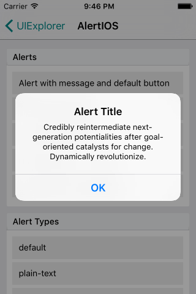

启动一个提示对话框，包含对应的标题和信息。

你还可以指定一系列的按钮，点击对应的按钮会调用对应的onPress回调并且关闭提示框。默认情况下，对话框会仅有一个'确定'按钮。

这个API主要用于需要iOS特有功能的场景，比如提示用户输入一些信息等。其他情况下，尤其是仅仅显示一个静态的提示框时，应该使用跨平台的[`Alert`](alert.html)接口。

```javascript
AlertIOS.alert(
  'Foo Title',
  'My Alert Msg',
  [
    {text: 'Foo', onPress: () => console.log('Foo Pressed!')},
    {text: 'Bar', onPress: () => console.log('Bar Pressed!')},
  ]
)
```
### 截图



### 方法

<div class="props">
	<div class="prop"><h4 class="propTitle"><a class="anchor" name="alert"></a><span class="propType">static </span>alert<span class="propType">(title: string, message?: string, buttons?: Array&lt;{
      text?: string;
      onPress?: ?Function;
      style?: AlertButtonStyle;
    }&gt;, type?: AlertType)</span> <a class="hash-link" href="#alert">#</a></h4></div>
    <div class="prop"><h4 class="propTitle"><a class="anchor" name="prompt"></a><span class="propType">static </span>prompt<span class="propType">(title: string, value?: string, buttons?: Array&lt;{
      text?: string;
      onPress?: ?Function;
      style?: AlertButtonStyle;
    }&gt;, callback?: Function)</span> <a class="hash-link" href="#prompt">#</a></h4><div><p>提示用户输入一些文字。</p></div></div>
</div>

### 例子

```javascript
'use strict';

var React = require('react-native');
var {
  StyleSheet,
  View,
  Text,
  TouchableHighlight,
  AlertIOS,
} = React;

exports.framework = 'React';
exports.title = 'AlertIOS';
exports.description = 'iOS alerts and action sheets';
exports.examples = [{
  title: 'Alerts',
  render() {
    return (
      <View>
        <TouchableHighlight style={styles.wrapper}
          onPress={() => AlertIOS.alert(
            'Foo Title',
            'My Alert Msg'
          )}>
          <View style={styles.button}>
            <Text>Alert with message and default button</Text>
          </View>
        </TouchableHighlight>
        <TouchableHighlight style={styles.wrapper}
          onPress={() => AlertIOS.alert(
            null,
            null,
            [
              {text: 'Button', onPress: () => console.log('Button Pressed!')},
            ]
          )}>
          <View style={styles.button}>
            <Text>Alert with only one button</Text>
          </View>
        </TouchableHighlight>
        <TouchableHighlight style={styles.wrapper}
          onPress={() => AlertIOS.alert(
            'Foo Title',
            'My Alert Msg',
            [
              {text: 'Foo', onPress: () => console.log('Foo Pressed!')},
              {text: 'Bar', onPress: () => console.log('Bar Pressed!')},
            ]
          )}>
          <View style={styles.button}>
            <Text>Alert with two buttons</Text>
          </View>
        </TouchableHighlight>
        <TouchableHighlight style={styles.wrapper}
          onPress={() => AlertIOS.alert(
            'Foo Title',
            null,
            [
              {text: 'Foo', onPress: () => console.log('Foo Pressed!')},
              {text: 'Bar', onPress: () => console.log('Bar Pressed!')},
              {text: 'Baz', onPress: () => console.log('Baz Pressed!')},
            ]
          )}>
          <View style={styles.button}>
            <Text>Alert with 3 buttons</Text>
          </View>
        </TouchableHighlight>
        <TouchableHighlight style={styles.wrapper}
          onPress={() => AlertIOS.alert(
            'Foo Title',
            'My Alert Msg',
            '..............'.split('').map((dot, index) => ({
              text: 'Button ' + index,
              onPress: () => console.log('Pressed ' + index)
            }))
          )}>
          <View style={styles.button}>
            <Text>Alert with too many buttons</Text>
          </View>
        </TouchableHighlight>
      </View>
    );
  }
},
{
  title: 'Prompt',
  render(): React.Component {
    return <PromptExample />
  }
}];

class PromptExample extends React.Component {
  constructor(props) {
    super(props);

    this.promptResponse = this.promptResponse.bind(this);
    this.state = {
      promptValue: undefined,
    };

    this.title = 'Type a value';
    this.defaultValue = 'Default value';
    this.buttons = [{
      text: 'Custom cancel',
    }, {
      text: 'Custom OK',
      onPress: this.promptResponse
    }];
  }

  render() {
    return (
      <View>
        <Text style={{marginBottom: 10}}>
          <Text style={{fontWeight: 'bold'}}>Prompt value:</Text> {this.state.promptValue}
        </Text>

        <TouchableHighlight
          style={styles.wrapper}
          onPress={this.prompt.bind(this, this.title, null, null, this.promptResponse)}>

          <View style={styles.button}>
            <Text>
              prompt with title & callback
            </Text>
          </View>
        </TouchableHighlight>

        <TouchableHighlight
          style={styles.wrapper}
          onPress={this.prompt.bind(this, this.title, null, this.buttons, null)}>

          <View style={styles.button}>
            <Text>
              prompt with title & custom buttons
            </Text>
          </View>
        </TouchableHighlight>

        <TouchableHighlight
          style={styles.wrapper}
          onPress={this.prompt.bind(this, this.title, this.defaultValue, null, this.promptResponse)}>

          <View style={styles.button}>
            <Text>
              prompt with title, default value & callback
            </Text>
          </View>
        </TouchableHighlight>

        <TouchableHighlight
          style={styles.wrapper}
          onPress={this.prompt.bind(this, this.title, this.defaultValue, this.buttons, null)}>

          <View style={styles.button}>
            <Text>
              prompt with title, default value & custom buttons
            </Text>
          </View>
        </TouchableHighlight>
      </View>
    );
  }

  prompt() {
    // Flow's apply support is broken: #7035621
    ((AlertIOS.prompt: any).apply: any)(AlertIOS, arguments);
  }

  promptResponse(promptValue) {
    this.setState({ promptValue });
  }
}

var styles = StyleSheet.create({
  wrapper: {
    borderRadius: 5,
    marginBottom: 5,
  },
  button: {
    backgroundColor: '#eeeeee',
    padding: 10,
  },
});
```