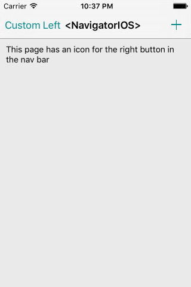
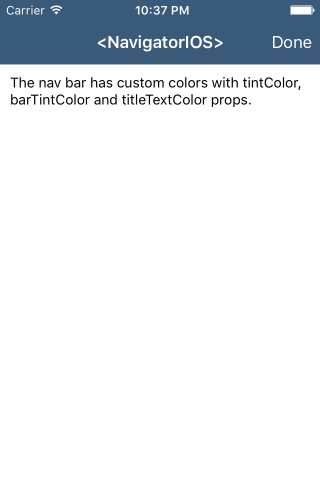

NavigatorIOS包装了UIKit的导航功能，可以使用左划功能来返回到上一界面。

> 注：本组件并非由Facebook官方开发组维护。  
> 
> 这一组件的开发完全由社区主导。如果纯js的方案能够满足你的需求的话，那么我们建议你选择`Navigator`组件。


### 截图




### 路由

一个路由是用于描述导航器中一页的对象。NavigatorIOS的第一个路由通过`initialRoute`属性来提供。

```javascript
render: function() {
  return (
    <NavigatorIOS
      initialRoute={{
        component: MyView,
        title: 'My View Title',
        passProps: { myProp: 'foo' },
      }}
    />
  );
},
```

现在MyView会被导航器渲染出来。它可以通过`route`属性获得对应的路由对象，导航器本身，还有所有`passProps`中传递的属性。
查看initialRoute的propTypes来了解路由（route）的完整定义。

### 导航器

导航器是一个object，包含了一系列导航函数，可供视图调用。它会作为props传递给NavigatorIOS渲染的任何组件。

```javascript
var MyView = React.createClass({
  _handleBackButtonPress: function() {
    this.props.navigator.pop();
  },
  _handleNextButtonPress: function() {
    this.props.navigator.push(nextRoute);
  },
  ...
});
```

一个导航器对象包含如下的函数：

* `push(route)` - 导航器跳转到一个新的路由。
* `pop()` - 回到上一页。
* `popN(n)` - 回到N页之前。当N=1的时候，效果和`pop()`一样。
* `replace(route)` - 替换当前页的路由，并立即加载新路由的视图。
* `replacePrevious(route)` - 替换上一页的路由/视图。
* `replacePreviousAndPop(route)` - 替换上一页的路由/视图并且立刻切换回上一页。
* `resetTo(route)` - 替换最顶级的路由并且回到它。
* `popToRoute(route)` - 一直回到某个指定的路由。
* `popToTop()` - 回到最顶层的路由。

导航函数也可以从NavigatorIOS的子组件中获得：

```javascript
var MyView = React.createClass({
  _handleNavigationRequest: function() {
    this.refs.nav.push(otherRoute);
  },
  render: () => (
    <NavigatorIOS
      ref="nav"
      initialRoute={...}
    />
  ),
});
```

### 属性

<div class="props">
	<div class="prop">
		<h4 class="propTitle"><a class="anchor" name="bartintcolor"></a>barTintColor <span class="propType">string</span> <a class="hash-link" href="#bartintcolor">#</a></h4>
		<div>
			<p>导航条的背景颜色。</p>
		</div>
	</div>
	<div class="prop">
		<h4 class="propTitle"><a class="anchor" name="initialroute"></a>initialRoute <span class="propType">{component: function, title: string, passProps: object, backButtonIcon: Image.propTypes.source, backButtonTitle: string, leftButtonIcon: Image.propTypes.source, leftButtonTitle: string, onLeftButtonPress: function, rightButtonIcon: Image.propTypes.source, rightButtonTitle: string, onRightButtonPress: function, wrapperStyle: [object Object]}</span> <a class="hash-link" href="#initialroute">#</a></h4>
		<div>
			<p>NavigatorIOS使用"路由"对象来包含要渲染的子视图、它们的属性、以及导航条配置。"push"和任何其它的导航函数的参数都是这样的路由对象。</p>
		</div>
	</div>
	<div class="prop">
		<h4 class="propTitle"><a class="anchor" name="itemwrapperstyle"></a>itemWrapperStyle <span class="propType"><a href="view.html#style">View#style</a></span> <a class="hash-link" href="#itemwrapperstyle">#</a></h4>
		<div>
			<p>导航器中的组件的默认属性。一个常见的用途是设置所有页面的背景颜色。</p>
		</div>
	</div>
	<div class="prop">
		<h4 class="propTitle"><a class="anchor" name="navigationbarhidden"></a>navigationBarHidden <span class="propType">bool</span> <a class="hash-link" href="#navigationbarhidden">#</a></h4>
		<div>
			<p>一个布尔值，决定导航栏是否隐藏。</p>
		</div>
	</div>
	<div class="prop">
		<h4 class="propTitle"><a class="anchor" name="shadowhidden"></a>shadowHidden <span class="propType">bool</span> <a class="hash-link" href="#shadowhidden">#</a></h4>
		<div>
			<p>一个布尔值，决定是否要隐藏1像素的阴影</p>
		</div>
	</div>
	<div class="prop">
		<h4 class="propTitle"><a class="anchor" name="tintcolor"></a>tintColor <span class="propType">string</span> <a class="hash-link" href="#tintcolor">#</a></h4>
		<div>
			<p>导航栏上按钮的颜色。</p>
		</div>
	</div>
	<div class="prop">
		<h4 class="propTitle"><a class="anchor" name="titletextcolor"></a>titleTextColor <span class="propType">string</span> <a class="hash-link" href="#titletextcolor">#</a></h4>
		<div>
			<p>导航器标题的文字颜色。</p>
		</div>
	</div>
	<div class="prop">
		<h4 class="propTitle"><a class="anchor" name="translucent"></a>translucent <span class="propType">bool</span> <a class="hash-link" href="#translucent">#</a></h4>
		<div>
			<p>一个布尔值，决定是否导航条是半透明的。</p>
		</div>
	</div>
	<div class="prop">
		<h4 class="propTitle"><a class="anchor" name="interactivepopgestureenabled"></a>interactivePopGestureEnabled <span class="propType">bool</span> <a class="hash-link" href="#interactivepopgestureenabled">#</a></h4>
		<div>
			<p>决定是否启用滑动返回手势。不指定此属性时，手势会根据navigationBar的显隐情况决定是否启用（显示时启用手势，隐藏时禁用手势）。指定此属性后，手势与navigationBar的显隐情况无关。</p>
		</div>
	</div>
</div>

### 方法

<div class="props">
    <div class="prop"><h4 class="propTitle"><a class="anchor" name="push"></a>push<span class="propType">(route: {
  component: Function;
  title: string;
  passProps?: Object;
  backButtonTitle?: string;
  backButtonIcon?: Object;
  leftButtonTitle?: string;
  leftButtonIcon?: Object;
  onLeftButtonPress?: Function;
  rightButtonTitle?: string;
  rightButtonIcon?: Object;
  onRightButtonPress?: Function;
  wrapperStyle?: any;
})</span> <a class="hash-link" href="#push">#</a></h4>
        <div><p>Navigate forward to a new route</p></div>
    </div>
    <div class="prop"><h4 class="propTitle"><a class="anchor" name="popn"></a>popN<span
            class="propType">(n: number)</span> <a class="hash-link" href="#popn">#</a></h4>
        <div><p>Go back N pages at once. When N=1, behavior matches <code>pop()</code></p></div>
    </div>
    <div class="prop"><h4 class="propTitle"><a class="anchor" name="pop"></a>pop<span class="propType">()</span> <a
            class="hash-link" href="#pop">#</a></h4>
        <div><p>Go back one page</p></div>
    </div>
    <div class="prop"><h4 class="propTitle"><a class="anchor" name="replaceatindex"></a>replaceAtIndex<span
            class="propType">(route: {
  component: Function;
  title: string;
  passProps?: Object;
  backButtonTitle?: string;
  backButtonIcon?: Object;
  leftButtonTitle?: string;
  leftButtonIcon?: Object;
  onLeftButtonPress?: Function;
  rightButtonTitle?: string;
  rightButtonIcon?: Object;
  onRightButtonPress?: Function;
  wrapperStyle?: any;
}, index: number)</span> <a class="hash-link" href="#replaceatindex">#</a></h4>
        <div><p>Replace a route in the navigation stack.</p>
            <p><code>index</code> specifies the route in the stack that should be replaced.
                If it's negative, it counts from the back.</p></div>
    </div>
    <div class="prop"><h4 class="propTitle"><a class="anchor" name="replace"></a>replace<span class="propType">(route: {
  component: Function;
  title: string;
  passProps?: Object;
  backButtonTitle?: string;
  backButtonIcon?: Object;
  leftButtonTitle?: string;
  leftButtonIcon?: Object;
  onLeftButtonPress?: Function;
  rightButtonTitle?: string;
  rightButtonIcon?: Object;
  onRightButtonPress?: Function;
  wrapperStyle?: any;
})</span> <a class="hash-link" href="#replace">#</a></h4>
        <div><p>Replace the route for the current page and immediately
            load the view for the new route.</p></div>
    </div>
    <div class="prop"><h4 class="propTitle"><a class="anchor" name="replaceprevious"></a>replacePrevious<span
            class="propType">(route: {
  component: Function;
  title: string;
  passProps?: Object;
  backButtonTitle?: string;
  backButtonIcon?: Object;
  leftButtonTitle?: string;
  leftButtonIcon?: Object;
  onLeftButtonPress?: Function;
  rightButtonTitle?: string;
  rightButtonIcon?: Object;
  onRightButtonPress?: Function;
  wrapperStyle?: any;
})</span> <a class="hash-link" href="#replaceprevious">#</a></h4>
        <div><p>Replace the route/view for the previous page.</p></div>
    </div>
    <div class="prop"><h4 class="propTitle"><a class="anchor" name="poptotop"></a>popToTop<span
            class="propType">()</span> <a class="hash-link" href="#poptotop">#</a></h4>
        <div><p>Go back to the top item</p></div>
    </div>
    <div class="prop"><h4 class="propTitle"><a class="anchor" name="poptoroute"></a>popToRoute<span class="propType">(route: {
  component: Function;
  title: string;
  passProps?: Object;
  backButtonTitle?: string;
  backButtonIcon?: Object;
  leftButtonTitle?: string;
  leftButtonIcon?: Object;
  onLeftButtonPress?: Function;
  rightButtonTitle?: string;
  rightButtonIcon?: Object;
  onRightButtonPress?: Function;
  wrapperStyle?: any;
})</span> <a class="hash-link" href="#poptoroute">#</a></h4>
        <div><p>Go back to the item for a particular route object</p></div>
    </div>
    <div class="prop"><h4 class="propTitle"><a class="anchor"
                                               name="replacepreviousandpop"></a>replacePreviousAndPop<span
            class="propType">(route: {
  component: Function;
  title: string;
  passProps?: Object;
  backButtonTitle?: string;
  backButtonIcon?: Object;
  leftButtonTitle?: string;
  leftButtonIcon?: Object;
  onLeftButtonPress?: Function;
  rightButtonTitle?: string;
  rightButtonIcon?: Object;
  onRightButtonPress?: Function;
  wrapperStyle?: any;
})</span> <a class="hash-link" href="#replacepreviousandpop">#</a></h4>
        <div><p>Replaces the previous route/view and transitions back to it.</p></div>
    </div>
    <div class="prop"><h4 class="propTitle"><a class="anchor" name="resetto"></a>resetTo<span class="propType">(route: {
  component: Function;
  title: string;
  passProps?: Object;
  backButtonTitle?: string;
  backButtonIcon?: Object;
  leftButtonTitle?: string;
  leftButtonIcon?: Object;
  onLeftButtonPress?: Function;
  rightButtonTitle?: string;
  rightButtonIcon?: Object;
  onRightButtonPress?: Function;
  wrapperStyle?: any;
})</span> <a class="hash-link" href="#resetto">#</a></h4>
        <div><p>Replaces the top item and popToTop</p></div>
    </div>
</div>

### 例子

```javascript
'use strict';

var React = require('react-native');
var ViewExample = require('./ViewExample');
var createExamplePage = require('./createExamplePage');
var {
  AlertIOS,
  PixelRatio,
  ScrollView,
  StyleSheet,
  Text,
  TouchableHighlight,
  View,
} = React;

var EmptyPage = React.createClass({

  render: function() {
    return (
      <View style={styles.emptyPage}>
        <Text style={styles.emptyPageText}>
          {this.props.text}
        </Text>
      </View>
    );
  },

});

var NavigatorIOSExample = React.createClass({

  statics: {
    title: '<NavigatorIOS>',
    description: 'iOS navigation capabilities',
  },

  render: function() {
    var recurseTitle = 'Recurse Navigation';
    if (!this.props.topExampleRoute) {
      recurseTitle += ' - more examples here';
    }
    return (
      <ScrollView style={styles.list}>
        <View style={styles.line}/>
        <View style={styles.group}>
          <View style={styles.row}>
            <Text style={styles.rowNote}>
              See &lt;UIExplorerApp&gt; for top-level usage.
            </Text>
          </View>
        </View>
        <View style={styles.line}/>
        <View style={styles.groupSpace}/>
        <View style={styles.line}/>
        <View style={styles.group}>
          {this._renderRow(recurseTitle, () => {
            this.props.navigator.push({
              title: NavigatorIOSExample.title,
              component: NavigatorIOSExample,
              backButtonTitle: 'Custom Back',
              passProps: {topExampleRoute: this.props.topExampleRoute || this.props.route},
            });
          })}
          {this._renderRow('Push View Example', () => {
            this.props.navigator.push({
              title: 'Very Long Custom View Example Title',
              component: createExamplePage(null, ViewExample),
            });
          })}
          {this._renderRow('Custom Right Button', () => {
            this.props.navigator.push({
              title: NavigatorIOSExample.title,
              component: EmptyPage,
              rightButtonTitle: 'Cancel',
              onRightButtonPress: () => this.props.navigator.pop(),
              passProps: {
                text: 'This page has a right button in the nav bar',
              }
            });
          })}
          {this._renderRow('Custom Left & Right Icons', () => {
            this.props.navigator.push({
              title: NavigatorIOSExample.title,
              component: EmptyPage,
              leftButtonTitle: 'Custom Left',
              onLeftButtonPress: () => this.props.navigator.pop(),
              rightButtonIcon: require('image!NavBarButtonPlus'),
              onRightButtonPress: () => {
                AlertIOS.alert(
                  'Bar Button Action',
                  'Recognized a tap on the bar button icon',
                  [
                    {
                      text: 'OK',
                      onPress: () => console.log('Tapped OK'),
                    },
                  ]
                );
              },
              passProps: {
                text: 'This page has an icon for the right button in the nav bar',
              }
            });
          })}
          {this._renderRow('Pop', () => {
            this.props.navigator.pop();
          })}
          {this._renderRow('Pop to top', () => {
            this.props.navigator.popToTop();
          })}
          {this._renderRow('Replace here', () => {
            var prevRoute = this.props.route;
            this.props.navigator.replace({
              title: 'New Navigation',
              component: EmptyPage,
              rightButtonTitle: 'Undo',
              onRightButtonPress: () => this.props.navigator.replace(prevRoute),
              passProps: {
                text: 'The component is replaced, but there is currently no ' +
                  'way to change the right button or title of the current route',
              }
            });
          })}
          {this._renderReplacePrevious()}
          {this._renderReplacePreviousAndPop()}
          {this._renderPopToTopNavExample()}
        </View>
        <View style={styles.line}/>
      </ScrollView>
    );
  },

  _renderPopToTopNavExample: function() {
    if (!this.props.topExampleRoute) {
      return null;
    }
    return this._renderRow('Pop to top NavigatorIOSExample', () => {
      this.props.navigator.popToRoute(this.props.topExampleRoute);
    });
  },

  _renderReplacePrevious: function() {
    if (!this.props.topExampleRoute) {
      // this is to avoid replacing the UIExplorerList at the top of the stack
      return null;
    }
    return this._renderRow('Replace previous', () => {
      this.props.navigator.replacePrevious({
        title: 'Replaced',
        component: EmptyPage,
        passProps: {
          text: 'This is a replaced "previous" page',
        },
        wrapperStyle: styles.customWrapperStyle,
      });
    });
  },

  _renderReplacePreviousAndPop: function() {
    if (!this.props.topExampleRoute) {
      // this is to avoid replacing the UIExplorerList at the top of the stack
      return null;
    }
    return this._renderRow('Replace previous and pop', () => {
      this.props.navigator.replacePreviousAndPop({
        title: 'Replaced and Popped',
        component: EmptyPage,
        passProps: {
          text: 'This is a replaced "previous" page',
        },
        wrapperStyle: styles.customWrapperStyle,
      });
    });
  },

  _renderRow: function(title: string, onPress: Function) {
    return (
      <View>
        <TouchableHighlight onPress={onPress}>
          <View style={styles.row}>
            <Text style={styles.rowText}>
              {title}
            </Text>
          </View>
        </TouchableHighlight>
        <View style={styles.separator} />
      </View>
    );
  },
});

var styles = StyleSheet.create({
  customWrapperStyle: {
    backgroundColor: '#bbdddd',
  },
  emptyPage: {
    flex: 1,
    paddingTop: 64,
  },
  emptyPageText: {
    margin: 10,
  },
  list: {
    backgroundColor: '#eeeeee',
    marginTop: 10,
  },
  group: {
    backgroundColor: 'white',
  },
  groupSpace: {
    height: 15,
  },
  line: {
    backgroundColor: '#bbbbbb',
    height: 1 / PixelRatio.get(),
  },
  row: {
    backgroundColor: 'white',
    justifyContent: 'center',
    paddingHorizontal: 15,
    paddingVertical: 15,
  },
  separator: {
    height: 1 / PixelRatio.get(),
    backgroundColor: '#bbbbbb',
    marginLeft: 15,
  },
  rowNote: {
    fontSize: 17,
  },
  rowText: {
    fontSize: 17,
    fontWeight: '500',
  },
});

module.exports = NavigatorIOSExample;
```
